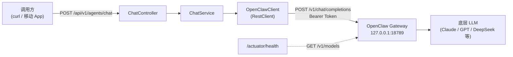
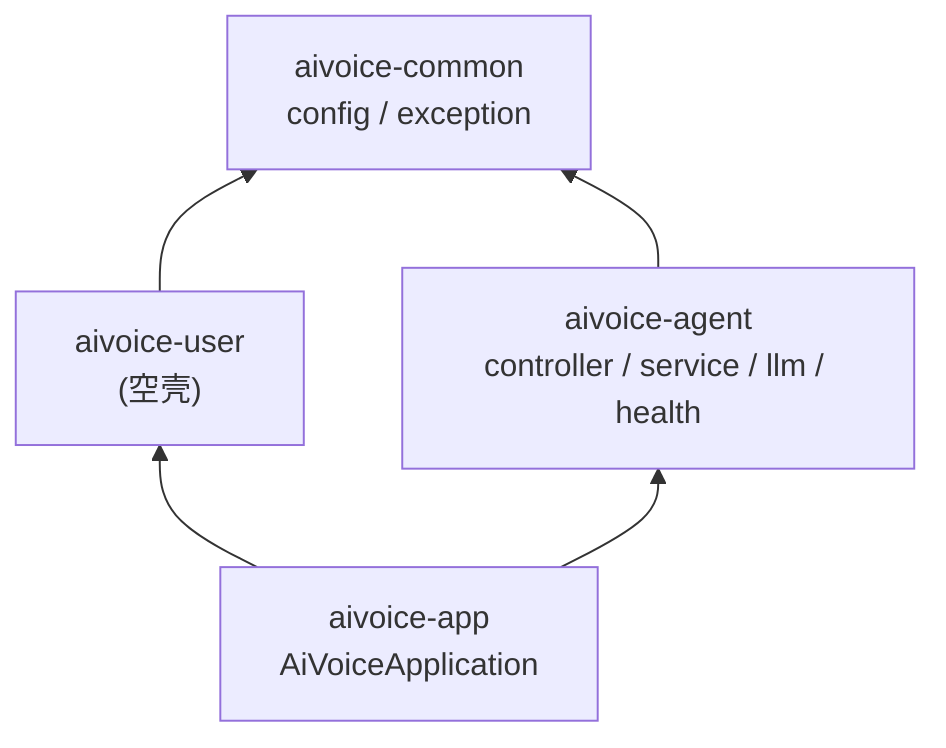

# AIVoice 后端实现说明

## 文档信息

| 项目         | 内容                                              |
| ------------ | ------------------------------------------------- |
| **文档名称** | AIVoice 后端实现说明                              |
| **版本**     | v1.4                                              |
| **最后更新** | 2026-06-12                                        |
| **作者**     | cloudzao                                          |
| **对应阶段** | MVP - 阶段一：Spring Boot ↔ 本地 OpenClaw 对接   |
| **配套文档** | [YoooClaw C·ONE 仿制产品架构设计文档.md](YoooClaw%20C·ONE%20仿制产品架构设计文档.md) |

---

## 1. 项目概览

本项目是 [YoooClaw C·ONE 仿制产品架构设计文档.md](YoooClaw%20C·ONE%20仿制产品架构设计文档.md) 第 4.2 节"通用 Agent 调用（同步）"链路的 Java 后端实现。当前阶段聚焦：

- **目标**：打通 `客户端 → Spring Boot 业务后端 → 本地 OpenClaw Gateway → LLM` 全链路
- **范围**：MVP，仅同步对话，不涉及计费、订阅、会议总结等业务域
- **技术栈**：Java 21 + Spring Boot 3.5.15 + Maven 多模块 + Lombok

### 1.1 链路示意



> 项目已接入 **springdoc-openapi 2.8.17**，所有对外 REST 接口的最新协议可在应用启动后通过
> `http://127.0.0.1:8080/swagger-ui.html` 在线查阅，无需依赖本文档手动维护。
> 详见 [§ 6.1 在线 OpenAPI 文档（Swagger UI）](#61-在线-openapi-文档swagger-ui)。
>
> **多模块依赖管理铁律**：每次修改任意子模块的 `pom.xml`（新增/删除依赖、升级版本号）后，
> **必须在仓库根目录执行 `./mvnw -DskipTests install` 一次**，把最新 pom 写入本地 `~/.m2` 仓库。
> 否则用 `cd aivoice-app && ./mvnw spring-boot:run` 启动时，maven 会从本地仓库拉**陈旧的子模块 pom**，
> 导致新加的依赖不进 classpath，运行期端点会以 `NoResourceFoundException` 形式 500（启动日志却干净无报错），
> 排查极其费时。CI 与本地启动脚本应固定走 `mvn install` → `mvn spring-boot:run` 这条流水线。

---

## 2. 多模块结构

项目采用 Maven 多模块（parent + 4 children）组织，强制业务边界清晰、避免后期单模块臃肿。

### 2.1 目录树

```
d:\project\AIVoice\
├── pom.xml                     # 父 POM (packaging=pom, 管理子模块与依赖版本)
├── aivoice-common/             # 公共基础设施
│   └── src/main/java/com/cloudzao/aivoice/common/
│       ├── config/             # OpenClaw 配置与 RestClient Bean
│       └── exception/          # 自定义异常 + 全局异常处理器
├── aivoice-user/               # 用户与设备域 (当前空壳, 后续扩展)
├── aivoice-agent/              # 聊天 / LLM / OpenClaw 对接业务
│   └── src/main/java/com/cloudzao/aivoice/agent/
│       ├── controller/         # REST API 入口
│       ├── service/            # 业务编排
│       ├── llm/                # OpenClaw 客户端
│       └── health/             # OpenClaw 网关健康探活
├── aivoice-app/                # 启动聚合模块 (仅 main + application.yaml)
└── docs/                       # 设计与实现文档
```

### 2.2 模块依赖关系



| 模块 | 依赖 | 主要职责 |
| --- | --- | --- |
| [aivoice-common](../aivoice-common) | 无内部依赖 | 配置类、异常基类、全局异常处理器 |
| [aivoice-user](../aivoice-user) | common | 用户与设备域（占位，未实现）|
| [aivoice-agent](../aivoice-agent) | common | 聊天 API、OpenClaw 客户端、健康探活 |
| [aivoice-app](../aivoice-app) | user + agent | Spring Boot 启动入口，聚合所有 Bean |

### 2.3 为什么这样拆

- **avoice-common** 不能依赖任何业务模块，反过来所有业务模块依赖它，保证基础设施单向沉降
- **aivoice-app** 不写任何业务代码，仅做 main + yaml + Bean 聚合，便于将来拆分成微服务时按模块独立部署
- **aivoice-user** 提前占位，预留后续"用户注册/设备绑定"等接口，让团队新增功能时不再纠结"放哪儿"
- **springdoc-openapi 依赖与 `OpenApiConfig` 沉到 `aivoice-common`** —— 任何业务模块加了 `@RestController` 都自动出现在 Swagger UI 中，无需重复声明文档元数据
- 新业务域（如 billing / task）只需新增子模块，根 POM 加一行 `<module>`，零侵入

---

## 3. 核心代码逻辑

### 3.1 OpenClaw 客户端层（aivoice-agent/llm）

#### OpenClawClient 接口

定义 OpenClaw 网关访问能力，便于将来切换实现（HTTP → WebSocket → Mock）。

```13:31:aivoice-agent/src/main/java/com/cloudzao/aivoice/agent/llm/OpenClawClient.java
public interface OpenClawClient {

    /**
     * 调用 OpenClaw 聊天补全接口，同步返回完整结果。
     *
     * @param request 请求体
     * @return 上游返回的完整响应；不为 {@code null}
     * @throws OpenClawException 上游非 2xx 或网络不可达时抛出
     */
    ChatCompletionResponse chatCompletion(ChatCompletionRequest request);

    /**
     * 调用 OpenClaw 模型列表接口，返回原始 JSON 字符串，主要用于健康探活。
     *
     * @return 上游返回的原始 JSON 字符串
     * @throws OpenClawException 上游非 2xx 或网络不可达时抛出
     */
    String listModelsRaw();
}
```

#### OpenClawHttpClient 实现要点

[aivoice-agent/src/main/java/com/cloudzao/aivoice/agent/llm/OpenClawHttpClient.java](../aivoice-agent/src/main/java/com/cloudzao/aivoice/agent/llm/OpenClawHttpClient.java) 关键设计：

1. **复用** `aivoice-common` 提供的 `RestClient` Bean，已预绑定 `Bearer Token` 与超时
2. **错误统一收敛**：所有上游非 2xx 通过 `.onStatus()` 拦截，包装为 `OpenClawException`
3. **网络异常映射**：`ResourceAccessException`（连接拒绝/超时）人为映射为 `status=503` 的 `OpenClawException`
4. **可观测性**：成功路径以 INFO 级别打印 `model / latencyMs / promptTokens / completionTokens / totalTokens`，为后续接入 Kafka 计费铺垫

```36:64:aivoice-agent/src/main/java/com/cloudzao/aivoice/agent/llm/OpenClawHttpClient.java
    @Override
    public ChatCompletionResponse chatCompletion(ChatCompletionRequest request) {
        long startMs = System.currentTimeMillis();
        try {
            ChatCompletionResponse response = openClawRestClient.post()
                    .uri(properties.endpoint().chat())
                    .contentType(MediaType.APPLICATION_JSON)
                    .body(request)
                    .retrieve()
                    .onStatus(HttpStatusCode::isError, (req, res) -> {
                        String body = readBody(res.getBody());
                        throw new OpenClawException(res.getStatusCode().value(), body);
                    })
                    .body(ChatCompletionResponse.class);
            long elapsed = System.currentTimeMillis() - startMs;
            if (response != null && response.usage() != null) {
                log.info("OpenClaw chat ok: model={}, latencyMs={}, promptTokens={}, completionTokens={}, totalTokens={}",
                        response.model(), elapsed,
                        response.usage().promptTokens(),
                        response.usage().completionTokens(),
                        response.usage().totalTokens());
            } else {
                log.info("OpenClaw chat ok: model={}, latencyMs={}, usage=unknown",
                        response != null ? response.model() : "n/a", elapsed);
            }
            return response;
        } catch (OpenClawException e) {
            log.warn("OpenClaw chat upstream error: status={}, body={}", e.getStatus(), e.getUpstreamBody());
            throw e;
        }
```

#### LLM 协议 DTO（OpenAI 兼容）

| DTO | 文件 | 用途 |
| --- | --- | --- |
| `ChatMessage` | [ChatMessage.java](../aivoice-agent/src/main/java/com/cloudzao/aivoice/agent/llm/dto/ChatMessage.java) | role + content，提供 `system()`/`user()`/`assistant()` 工厂方法 |
| `ChatCompletionRequest` | [ChatCompletionRequest.java](../aivoice-agent/src/main/java/com/cloudzao/aivoice/agent/llm/dto/ChatCompletionRequest.java) | 请求体，`@JsonInclude(NON_NULL)` 自动忽略空字段 |
| `ChatCompletionResponse` | [ChatCompletionResponse.java](../aivoice-agent/src/main/java/com/cloudzao/aivoice/agent/llm/dto/ChatCompletionResponse.java) | 响应体，提供 `firstContent()` 便捷方法 |
| `Usage` | [Usage.java](../aivoice-agent/src/main/java/com/cloudzao/aivoice/agent/llm/dto/Usage.java) | token 用量，下划线字段映射 |

### 3.2 业务编排层（aivoice-agent/service）

[ChatService.java](../aivoice-agent/src/main/java/com/cloudzao/aivoice/agent/service/ChatService.java) 不感知 HTTP 协议，提供同步与流式两条路径，共用一份请求构造逻辑：

| 路径 | 入口 | 上游调用 | 输出 |
| --- | --- | --- | --- |
| 同步 | `chat(ChatRequest)` | `OpenClawClient.chatCompletion(...)` | `ChatResponse`（含 reply + token usage）|
| 流式 | `chatStream(ChatRequest, SseEmitter)` | `OpenClawClient.chatCompletionStream(req, onContent, onComplete, onError)` | 通过 `SseEmitter` 逐 chunk 推 |

两条路径共享私有 helper `buildUpstreamRequest(request, stream)`，避免 model / systemPrompt / messages 的解析逻辑分叉漂移：

```44:57:aivoice-agent/src/main/java/com/cloudzao/aivoice/agent/service/ChatService.java
    public ChatResponse chat(ChatRequest request) {
        ChatCompletionRequest upstream = buildUpstreamRequest(request, Boolean.FALSE);
        ChatCompletionResponse response = client.chatCompletion(upstream);
        String reply = response.firstContent().orElse("");

        ChatResponse.TokenUsage usage = response.usage() == null
                ? new ChatResponse.TokenUsage(null, null, null)
                : new ChatResponse.TokenUsage(
                response.usage().promptTokens(),
                response.usage().completionTokens(),
                response.usage().totalTokens());

        return new ChatResponse(response.model(), reply, usage);
    }
```

流式路径的关键约束：**任何异常都不能从 `chatStream` 签名抛出**，因为响应头此时通常已经发出，再走 `GlobalExceptionHandler` 返 problem+json 已无意义；统一通过 `SseEmitter.completeWithError(Throwable)` 让 Spring 决定如何中断响应。

```74:81:aivoice-agent/src/main/java/com/cloudzao/aivoice/agent/service/ChatService.java
    public void chatStream(ChatRequest request, SseEmitter emitter) {
        ChatCompletionRequest upstream = buildUpstreamRequest(request, Boolean.TRUE);
        client.chatCompletionStream(
                upstream,
                content -> sendOrFail(emitter, content),
                emitter::complete,
                emitter::completeWithError);
    }
```

### 3.3 REST 接口层（aivoice-agent/controller）

[ChatController.java](../aivoice-agent/src/main/java/com/cloudzao/aivoice/agent/controller/ChatController.java) 暴露 2 个端点，均极薄，仅做"参数校验 + 委托 Service"：

| 端点 | 方法 | 媒体类型 | 用途 |
| --- | --- | --- | --- |
| `/chat` | `POST` | `application/json` | 同步问答 |
| `/chat/stream` | `POST` | `text/event-stream` | SSE 流式问答（Python ASR 等中间服务消费） |

**流式端点的请求体与同步端点完全一致（复用 `ChatRequest`）**，差别只在响应媒体类型与处理流程：

```145:159:aivoice-agent/src/main/java/com/cloudzao/aivoice/agent/controller/ChatController.java
    @PostMapping(value = "/chat/stream",
            consumes = MediaType.APPLICATION_JSON_VALUE,
            produces = MediaType.TEXT_EVENT_STREAM_VALUE)
    public SseEmitter chatStream(@Valid @RequestBody ChatRequest request) {
        SseEmitter emitter = new SseEmitter(STREAM_EMITTER_TIMEOUT_MS);
        emitter.onTimeout(() -> {
            log.info("SSE emitter timed out after {}ms, completing", STREAM_EMITTER_TIMEOUT_MS);
            emitter.complete();
        });
        emitter.onError(throwable ->
                log.warn("SSE emitter error (likely client disconnect): {}", throwable.getMessage()));
        chatStreamExecutor.execute(() -> chatService.chatStream(request, emitter));
        return emitter;
    }
```

**关键设计点**：

- `chatStreamExecutor`（[AsyncConfig.java](../aivoice-agent/src/main/java/com/cloudzao/aivoice/agent/config/AsyncConfig.java) 中定义的 `ThreadPoolTaskExecutor`，core=4 / max=16 / queue=64）专门承接流式任务，让 Tomcat 工作线程在创建 emitter 后立刻释放
- 5 分钟空闲超时（`STREAM_EMITTER_TIMEOUT_MS`）覆盖最长上游推理；客户端断开时 `onError` 仅打 INFO 日志，不抛异常
- 上游 OpenClaw 协议尾部的 `data: [DONE]` 哨兵在 [OpenClawHttpClient.java](../aivoice-agent/src/main/java/com/cloudzao/aivoice/agent/llm/OpenClawHttpClient.java) 内被吸收，**不会透传给客户端**；客户端按 SSE 标准等待连接关闭即可

**对外 DTO 与上游协议 DTO 解耦**：

- 对外：[ChatRequest.java](../aivoice-agent/src/main/java/com/cloudzao/aivoice/agent/controller/dto/ChatRequest.java) / [ChatResponse.java](../aivoice-agent/src/main/java/com/cloudzao/aivoice/agent/controller/dto/ChatResponse.java)
- 对上游：[ChatCompletionRequest.java](../aivoice-agent/src/main/java/com/cloudzao/aivoice/agent/llm/dto/ChatCompletionRequest.java) / [ChatCompletionResponse.java](../aivoice-agent/src/main/java/com/cloudzao/aivoice/agent/llm/dto/ChatCompletionResponse.java)

OpenClaw 协议变化时，对外 DTO 保持稳定，调用方无感知。

### 3.4 配置与启动校验（aivoice-common/config）

#### OpenClawProperties

```37:44:aivoice-common/src/main/java/com/cloudzao/aivoice/common/config/OpenClawProperties.java
@ConfigurationProperties(prefix = "openclaw")
public record OpenClawProperties(
        String baseUrl,
        String token,
        String defaultModel,
        Endpoint endpoint,
        Timeout timeout
) {
```

#### OpenClawClientConfig - fail-fast 校验

[OpenClawClientConfig.java](../aivoice-common/src/main/java/com/cloudzao/aivoice/common/config/OpenClawClientConfig.java) 在 `@PostConstruct` 阶段强制校验：

- `baseUrl` 不能为空
- `token` 不能为空（缺失时 Spring 上下文启动失败）
- `endpoint.chat / endpoint.models` 不能为空
- `timeout.connect / timeout.read` 不能为空

避免应用以"看起来正常但实际无法对外提供服务"的状态启动 —— 一旦缺关键配置，容器在 `refresh()` 阶段直接抛 `IllegalStateException`，运维同学第一时间能在启动日志里看到原因，而不是等到第一笔流量打进来才暴露。

#### RestClient Bean 复用策略

`openClawRestClient` 这个 Bean 在 `aivoice-common` 中统一构造，预绑定了三件事：

1. `baseUrl` —— 业务模块只需关心 path，不再硬编码 host
2. `Authorization: Bearer ${token}` —— 调用方零感知鉴权
3. 连接超时 + 读超时 —— 通过 `SimpleClientHttpRequestFactory` 显式设置，避免默认 `∞` 阻塞线程

```79:91:aivoice-common/src/main/java/com/cloudzao/aivoice/common/config/OpenClawClientConfig.java
    @Bean
    public RestClient openClawRestClient() {
        SimpleClientHttpRequestFactory factory = new SimpleClientHttpRequestFactory();
        factory.setConnectTimeout((int) properties.timeout().connect().toMillis());
        factory.setReadTimeout((int) properties.timeout().read().toMillis());

        return RestClient.builder()
                .baseUrl(properties.baseUrl())
                .requestFactory(factory)
                .defaultHeader(HttpHeaders.AUTHORIZATION, "Bearer " + properties.token())
                .defaultHeader(HttpHeaders.ACCEPT, MediaType.APPLICATION_JSON_VALUE)
                .build();
    }
```

> 后续若要切换到 Reactor `WebClient`（流式 SSE）或加上连接池（Apache HttpClient5），只需在本 Bean 内做替换，业务模块零修改。

#### CorsProperties + CorsConfig - 全局跨域

[CorsProperties.java](../aivoice-common/src/main/java/com/cloudzao/aivoice/common/config/CorsProperties.java) 把所有跨域参数收敛到 `aivoice.cors.*` 命名空间下；[CorsConfig.java](../aivoice-common/src/main/java/com/cloudzao/aivoice/common/config/CorsConfig.java) 实现 `WebMvcConfigurer.addCorsMappings(...)` 把配置注册到 Spring MVC 的 CORS 处理链。运行期效果：

- `OPTIONS` 预检请求由 Spring 自动应答，无需在每个 Controller 上手写 `@CrossOrigin`
- 同步 `/api/v1/agents/chat`、流式 `/api/v1/agents/chat/stream`、未来新增的所有 `/api/**` 端点均统一覆盖
- `/actuator/**`、`/swagger-ui/**`、`/v3/api-docs/**` 不在 `path-pattern` 范围内 —— 这些是同源访问端点，无需跨域

启动日志会打印当前生效配置，方便排查环境差异：

```
INFO ... CorsConfig : CORS configured: pathPattern=/api/**,
  allowedOriginPatterns=[http://localhost:[*], http://127.0.0.1:[*], ...],
  methods=[GET, POST, PUT, DELETE, OPTIONS, HEAD],
  allowCredentials=false, maxAge=PT1H
```

详细配置项与运行时校验规则见 [§ 4.4 跨域（CORS）配置项](#44-跨域cors配置项)。

### 3.5 异常处理与统一错误响应（aivoice-common/exception）

#### OpenClawException

[OpenClawException.java](../aivoice-common/src/main/java/com/cloudzao/aivoice/common/exception/OpenClawException.java) 是上游调用层的"领域异常"，承载两个关键字段：

| 字段 | 含义 | 设计目的 |
| --- | --- | --- |
| `status` | 上游 HTTP 状态码 | 网络不可达时人为映射为 `503`，让上层一视同仁 |
| `upstreamBody` | 上游原始响应体 | 排障定位用，避免吞掉 OpenClaw 的真实报错 |

#### GlobalExceptionHandler - RFC 7807 ProblemDetail

[GlobalExceptionHandler.java](../aivoice-common/src/main/java/com/cloudzao/aivoice/common/exception/GlobalExceptionHandler.java) 将所有异常统一转换为 `application/problem+json` 标准格式（[RFC 7807](https://datatracker.ietf.org/doc/html/rfc7807)），符合架构文档第 6.2 节安全策略 —— **绝不向客户端泄漏 stack trace**。

异常映射策略：

| 异常类型 | 对外 HTTP 状态码 | 说明 |
| --- | --- | --- |
| `OpenClawException` (401/403) | 502 Bad Gateway | 上游鉴权问题对调用方表现为"网关错误"，避免泄漏内部 token 状态 |
| `OpenClawException` (404) | 502 Bad Gateway | 上游路由问题同样视为网关问题 |
| `OpenClawException` (503/504) | 503 Service Unavailable | 上下游传递性表达"暂时不可用" |
| `OpenClawException` (5xx) | 502 Bad Gateway | 上游内部错误 |
| `MethodArgumentNotValidException` | 400 Bad Request | Bean Validation 失败，附带 `fieldErrors` |
| `HttpMessageNotReadableException` | 400 Bad Request | JSON 解析失败 |
| `IllegalArgumentException` | 400 Bad Request | 业务参数校验 |
| `Exception`（兜底） | 500 Internal Server Error | 仅打印堆栈到日志，不返回给客户端 |

```109:126:aivoice-common/src/main/java/com/cloudzao/aivoice/common/exception/GlobalExceptionHandler.java
    private HttpStatus mapUpstreamStatus(int upstream) {
        if (upstream == 401 || upstream == 403) {
            return HttpStatus.BAD_GATEWAY;
        }
        if (upstream == 404) {
            return HttpStatus.BAD_GATEWAY;
        }
        if (upstream == 503 || upstream == 504) {
            return HttpStatus.SERVICE_UNAVAILABLE;
        }
        if (upstream >= 500) {
            return HttpStatus.BAD_GATEWAY;
        }
        if (upstream >= 400) {
            return HttpStatus.BAD_REQUEST;
        }
        return HttpStatus.INTERNAL_SERVER_ERROR;
    }
```

错误响应示例（OpenClaw token 失效）：

```json
{
  "type": "https://aivoice.cloudzao.com/errors/openclaw-upstream",
  "title": "OpenClaw Upstream Error",
  "status": 502,
  "detail": "OpenClaw upstream returned status 401",
  "instance": "/api/v1/agents/chat",
  "upstreamStatus": 401,
  "upstreamBody": "{\"error\":\"invalid token\"}"
}
```

### 3.6 健康探活（aivoice-agent/health）

[OpenClawHealthIndicator.java](../aivoice-agent/src/main/java/com/cloudzao/aivoice/agent/health/OpenClawHealthIndicator.java) 实现 Spring Boot Actuator 的 `HealthIndicator`，让 `/actuator/health` 自动包含一个名为 `openclaw` 的子项：

- **探活动作**：`GET ${baseUrl}${endpoint.models}`，复用业务客户端，确保 token / 网络路径与正常调用一致
- **UP 时返回**：`baseUrl`、`endpoint`、`latencyMs`、`responseSize`，便于监控系统抓取上游耗时
- **DOWN 时返回**：`upstreamStatus` + `error`，不暴露 token 等敏感信息
- **探针接入**：`application.yaml` 已开启 `probes.enabled=true`，K8s 可直接接入 `/actuator/health/liveness` 与 `/actuator/health/readiness`

```26:50:aivoice-agent/src/main/java/com/cloudzao/aivoice/agent/health/OpenClawHealthIndicator.java
    @Override
    public Health health() {
        long start = System.currentTimeMillis();
        try {
            String body = client.listModelsRaw();
            long latency = System.currentTimeMillis() - start;
            return Health.up()
                    .withDetail("baseUrl", properties.baseUrl())
                    .withDetail("endpoint", properties.endpoint().models())
                    .withDetail("latencyMs", latency)
                    .withDetail("responseSize", body == null ? 0 : body.length())
                    .build();
        } catch (OpenClawException ex) {
            return Health.down()
                    .withDetail("baseUrl", properties.baseUrl())
                    .withDetail("upstreamStatus", ex.getStatus())
                    .withDetail("error", ex.getMessage())
                    .build();
        } catch (Exception ex) {
            log.warn("OpenClaw health check failed: {}", ex.getMessage());
            return Health.down(ex)
                    .withDetail("baseUrl", properties.baseUrl())
                    .build();
        }
    }
```

---

## 4. 配置说明

[application.yaml](../aivoice-app/src/main/resources/application.yaml) 当前完整配置（环境变量优先，便于容器化部署）：

```yaml
spring:
  application:
    name: AIVoice
  profiles:
    active: ${SPRING_PROFILES_ACTIVE:local}

server:
  port: 8080
  error:
    include-stacktrace: never        # 禁止响应体携带 stack trace

openclaw:
  base-url: ${OPENCLAW_GATEWAY_URL:http://127.0.0.1:18789}
  token: ${OPENCLAW_GATEWAY_TOKEN:<dev-token>}
  default-model: ${OPENCLAW_DEFAULT_MODEL:openclaw}
  endpoint:
    chat: /v1/chat/completions
    models: /v1/models
  timeout:
    connect: 5s
    read: 60s

management:
  endpoints:
    web:
      exposure:
        include: health,info,metrics
  endpoint:
    health:
      show-details: when-authorized
      probes:
        enabled: true

springdoc:
  api-docs:
    path: /v3/api-docs
    enabled: true
  swagger-ui:
    path: /swagger-ui.html
    operations-sorter: alpha
    tags-sorter: alpha
    display-request-duration: true
    try-it-out-enabled: true
  packages-to-scan: com.cloudzao.aivoice
  paths-to-match: /api/**
  default-produces-media-type: application/json
  show-actuator: false

aivoice:
  cors:
    enabled: ${AIVOICE_CORS_ENABLED:true}
    path-pattern: /api/**
    allowed-origin-patterns:
      - http://localhost:[*]
      - http://127.0.0.1:[*]
      - https://localhost:[*]
      - https://127.0.0.1:[*]
      - capacitor://localhost
      - ionic://localhost
      - http://localhost
    allowed-methods: [GET, POST, PUT, DELETE, OPTIONS, HEAD]
    allowed-headers: ["*"]
    exposed-headers: [Content-Disposition]
    allow-credentials: false
    max-age: 1h
```

### 4.1 关键配置项

| Key | 必填 | 默认 | 推荐来源 | 说明 |
| --- | :---: | --- | --- | --- |
| `openclaw.base-url` | 是 | `http://127.0.0.1:18789` | `OPENCLAW_GATEWAY_URL` | OpenClaw Gateway 根地址 |
| `openclaw.token` | 是 | （内置占位） | `OPENCLAW_GATEWAY_TOKEN` | Gateway 共享密钥；执行 `openclaw doctor --generate-gateway-token` 生成 |
| `openclaw.default-model` | 否 | `openclaw` | `OPENCLAW_DEFAULT_MODEL` | 调用方未传 `model` 时使用 |
| `openclaw.endpoint.chat` | 是 | `/v1/chat/completions` | yaml | OpenAI 兼容路径 |
| `openclaw.endpoint.models` | 是 | `/v1/models` | yaml | 探活路径 |
| `openclaw.timeout.connect` | 是 | `5s` | yaml | TCP 建联超时 |
| `openclaw.timeout.read` | 是 | `60s` | yaml | LLM 推理慢，建议 ≥ 30s |

### 4.2 多环境策略

通过 `SPRING_PROFILES_ACTIVE` 切换环境：

- `local`（默认）：连本机 OpenClaw Gateway，token 来自环境变量
- `dev` / `staging` / `prod`：按需新增 `application-<profile>.yaml`，覆盖 `openclaw.base-url` 与 `token` 来源（推荐对接 KMS / Vault，禁止明文落仓库）

> **安全红线**：`application.yaml` 中的占位 token 仅供本地开发；上线前必须替换为环境变量或密钥管理系统注入，并把仓库历史中的明文 token 通过 `git-filter-repo` 清理。

### 4.3 OpenAPI / Swagger 配置项

[application.yaml](../aivoice-app/src/main/resources/application.yaml) 中 `springdoc.*` 一段控制接口文档行为：

| Key | 默认 | 说明 |
| --- | --- | --- |
| `springdoc.api-docs.path` | `/v3/api-docs` | OpenAPI JSON 路径；追加 `.yaml` 可拿到 YAML 版本 |
| `springdoc.api-docs.enabled` | `true` | 生产环境如需关闭文档暴露，设为 `false` |
| `springdoc.swagger-ui.path` | `/swagger-ui.html` | Swagger UI 入口；自动重定向到 `/swagger-ui/index.html` |
| `springdoc.swagger-ui.operations-sorter` | `alpha` | UI 中接口按字母排序，避免每次发版顺序漂移 |
| `springdoc.swagger-ui.tags-sorter` | `alpha` | Tag 同样按字母排序 |
| `springdoc.swagger-ui.display-request-duration` | `true` | "Try it out" 时显示请求耗时 |
| `springdoc.swagger-ui.try-it-out-enabled` | `true` | 直接在 UI 中发起真实调用 |
| `springdoc.packages-to-scan` | `com.cloudzao.aivoice` | 限定扫描范围，防止 Actuator/三方控制器混入 |
| `springdoc.paths-to-match` | `/api/**` | 仅暴露业务 API，过滤 `/actuator` 等管理端点 |
| `springdoc.show-actuator` | `false` | Actuator 端点不进 OpenAPI 文档 |

> **生产关闭文档**：阶段三接入鉴权前，建议在 `application-prod.yaml` 中设
> `springdoc.api-docs.enabled: false` 与 `springdoc.swagger-ui.enabled: false`，
> 或通过 Spring Security 把 `/v3/api-docs/**` 与 `/swagger-ui/**` 限制到内部 IP。

### 4.4 跨域（CORS）配置项

[application.yaml](../aivoice-app/src/main/resources/application.yaml) 中 `aivoice.cors.*` 控制全局跨域行为，由 [CorsConfig.java](../aivoice-common/src/main/java/com/cloudzao/aivoice/common/config/CorsConfig.java) 注册到 Spring MVC 的 CORS 处理链：

| Key | 默认 | 推荐来源 | 说明 |
| --- | --- | --- | --- |
| `aivoice.cors.enabled` | `true` | `AIVOICE_CORS_ENABLED` | 总开关；`false` 时本配置类不加载（`@ConditionalOnProperty`），恢复 Spring 默认无 CORS 行为 |
| `aivoice.cors.path-pattern` | `/api/**` | yaml | CORS 生效路径；`/actuator/**`、`/swagger-ui/**`、`/v3/api-docs/**` **不在范围内**（同源访问，无需跨域） |
| `aivoice.cors.allowed-origin-patterns` | localhost / capacitor 等 | `AIVOICE_CORS_ALLOWED_ORIGINS` | **不要写成 `allowed-origins`**，Spring 6.0+ 在 `allow-credentials=true` 时禁用 `*` origin，但 patterns 形式（`http://localhost:[*]`）支持通配 |
| `aivoice.cors.allowed-methods` | `GET,POST,PUT,DELETE,OPTIONS,HEAD` | yaml | 允许的 HTTP 方法 |
| `aivoice.cors.allowed-headers` | `["*"]` | yaml | 请求 header 白名单；阶段三接 JWT 后保持 `*` 即可（已隐含放行 `Authorization`） |
| `aivoice.cors.exposed-headers` | `[Content-Disposition]` | yaml | 浏览器默认仅暴露 6 个 simple header；如未来 SSE / 文件下载要在响应中放自定义头需在此追加 |
| `aivoice.cors.allow-credentials` | `false` | yaml | 当前阶段用 `Authorization: Bearer <jwt>` header 鉴权，不依赖 cookie；阶段三若引入 session/cookie 鉴权再开启，开启时 `allowed-origin-patterns` 不能含 `*` |
| `aivoice.cors.max-age` | `1h` | yaml | 浏览器对 OPTIONS 预检结果的缓存时长，缩短到秒级会显著增加预检请求量 |

#### 设计要点

1. **路径范围限定**：`path-pattern: /api/**` 让 CORS 只对业务 API 生效，不污染管理 / 文档端点。Swagger UI、Actuator 都是同源访问，本就不走 CORS。
2. **`allowedOriginPatterns` vs `allowedOrigins`**：Spring 6.0+ 严格要求带凭证的 CORS 不能用 `*` 通配，但 `allowedOriginPatterns` 支持 `http://localhost:[*]` 这种端口通配 / `https://*.aivoice.cloudzao.com` 这种二级域通配；本项目统一只用 patterns。
3. **fail-fast 启动校验**：[CorsConfig.validate()](../aivoice-common/src/main/java/com/cloudzao/aivoice/common/config/CorsConfig.java) 在容器启动时校验：
   - `path-pattern` 不能为空
   - `allowed-origin-patterns` 不能为空（强制业务方显式声明信任的来源）
   - `allow-credentials=true` 与 `allowed-origin-patterns` 含 `*` 不能共存（Spring 也会拒绝，提前到启动期暴露）
4. **SSE 流式接口透明覆盖**：`/api/v1/agents/chat/stream` 落在 `path-pattern: /api/**` 内，`SseEmitter` 的响应头会被 Spring 的 `CorsInterceptor` 自动叠加 CORS 头；浏览器 `EventSource` 按 SSE 标准走 CORS 流程，无需额外代码。
5. **生产环境收紧**：上线前**必须**把 `allowed-origin-patterns` 收敛到具体业务域（如 `https://app.aivoice.cloudzao.com`、`https://*.aivoice.cloudzao.com`），不要保留 `localhost` / `capacitor://localhost` 这些开发兜底项；推荐通过 `application-prod.yaml` 整体覆盖该列表，或注入 `AIVOICE_CORS_ALLOWED_ORIGINS` 环境变量。

#### 端到端验证

应用启动后，可用如下 `curl` 命令验证 CORS 头是否按预期返回（响应头需精确匹配 `Origin`，不是 `*`）：

```bash
# 1. 允许的 origin → 200，回显具体来源
curl -i -X OPTIONS http://127.0.0.1:8080/api/v1/agents/chat \
  -H "Origin: http://localhost:5173" \
  -H "Access-Control-Request-Method: POST" \
  -H "Access-Control-Request-Headers: Content-Type"
# 期望响应头：
#   Access-Control-Allow-Origin: http://localhost:5173
#   Access-Control-Allow-Methods: GET,POST,PUT,DELETE,OPTIONS,HEAD
#   Access-Control-Allow-Headers: Content-Type
#   Access-Control-Max-Age: 3600
#   Vary: Origin

# 2. 不在白名单的 origin → 403
curl -i -X OPTIONS http://127.0.0.1:8080/api/v1/agents/chat \
  -H "Origin: https://evil.example.com" \
  -H "Access-Control-Request-Method: POST"
# 期望响应：HTTP/1.1 403，且不带 Access-Control-Allow-Origin
```

集成测试覆盖 4 个核心场景，参见 [CorsIntegrationTest.java](../aivoice-app/src/test/java/com/cloudzao/aivoice/cors/CorsIntegrationTest.java)：允许的 localhost 端口通配、被拒的恶意 origin、精确域名 pattern、`/actuator/**` 路径不受 CORS 影响。

---

## 5. 启动与运行

### 5.1 前置条件

1. JDK 21（建议 Temurin 21.0.x）
2. 本地已运行 OpenClaw Gateway，监听 `127.0.0.1:18789`
3. 通过 `openclaw doctor --generate-gateway-token` 拿到一次性 token

### 5.2 命令清单

```powershell
# 1. 设置鉴权（PowerShell）
$env:OPENCLAW_GATEWAY_TOKEN = "<your-token>"

# 2. 编译并运行单元测试（不启动 Spring 上下文）
.\mvnw.cmd -pl aivoice-agent -am test

# 3.【铁律】凡是修改过任意子模块 pom.xml，先 install 再启动
#   把最新 pom + jar 写入本地 ~/.m2，避免 spring-boot:run 时 maven
#   从仓库拉陈旧的子模块 pom，导致新加依赖不进 classpath
.\mvnw.cmd -DskipTests install

# 4. 启动应用
#   推荐进 aivoice-app 子目录跑，避免 spring-boot:run 在 parent 上找不到 main class
cd aivoice-app
..\mvnw.cmd spring-boot:run
cd ..

# 5. 打可运行 jar（产物在 aivoice-app/target/）
.\mvnw.cmd -pl aivoice-app -am package
java -jar .\aivoice-app\target\aivoice-app-0.0.1-SNAPSHOT.jar
```

> **避坑速查**：启动后 `/v3/api-docs`、`/swagger-ui.html` 等返回 500（`NoResourceFoundException`），
> 但启动日志干净 + `Started AiVoiceApplication` 出现 + `/actuator/health` 返回 200 ——
> 99% 是上面第 3 步 `mvn install` 没跑。回到根目录跑一次再启动即可。

启动成功后日志关键标识：

```
OpenClaw client configured: baseUrl=http://127.0.0.1:18789, defaultModel=openclaw, ...
Tomcat started on port 8080 (http)
Started AiVoiceApplication in 2.x seconds
```

### 5.3 冒烟测试

```powershell
# 1. 健康探活（包含 OpenClaw 网关连通性）
curl http://127.0.0.1:8080/actuator/health

# 2. 拉取 OpenAPI JSON（CI / 客户端 SDK 生成器消费）
curl http://127.0.0.1:8080/v3/api-docs

# 3. 浏览器打开在线 API 文档（推荐）
Start-Process http://127.0.0.1:8080/swagger-ui.html

# 4. 同步对话
curl -X POST http://127.0.0.1:8080/api/v1/agents/chat `
     -H "Content-Type: application/json" `
     -d '{"message":"你好，介绍一下自己"}'
```

---

## 6. 接口契约

> **优先以 Swagger UI 为准**：本章给出的请求/响应示例仅作为 README 速览，**真正的契约以 OpenAPI 文档为准**，
> 通过 [springdoc-openapi](https://springdoc.org/) 直接由控制器与 DTO 上的 `@Operation` / `@Schema` 注解生成，
> 不会与代码漂移。

### 6.1 在线 OpenAPI 文档（Swagger UI）

应用启动后即可访问以下三个内置端点：

| 端点 | 用途 | 备注 |
| --- | --- | --- |
| `/swagger-ui.html` | 交互式 UI，支持"Try it out" | 浏览器打开 |
| `/v3/api-docs` | OpenAPI 3 JSON | 客户端 SDK 生成器（如 `openapi-generator`）消费 |
| `/v3/api-docs.yaml` | OpenAPI 3 YAML | 文档归档、Diff 友好 |

#### 文档元数据来源

[OpenApiConfig.java](../aivoice-common/src/main/java/com/cloudzao/aivoice/common/config/OpenApiConfig.java) 集中声明：

```50:81:aivoice-common/src/main/java/com/cloudzao/aivoice/common/config/OpenApiConfig.java
    @Bean
    public OpenAPI aiVoiceOpenAPI() {
        Info info = new Info()
                .title(applicationName + " Backend API")
                .description("""
                        AIVoice 后端 REST API 文档（MVP 阶段一）。

                        - 链路：客户端 → Spring Boot 业务后端 → 本地 OpenClaw Gateway → LLM
                        - 错误响应统一使用 RFC 7807 `application/problem+json`
                        - 所有接口前缀：`/api/v1`
                        """)
                .version("v1.0")
                .contact(new Contact()
                        .name("cloudzao")
                        .url("https://aivoice.cloudzao.com"))
                .license(new License()
                        .name("Proprietary")
                        .url("https://aivoice.cloudzao.com/license"));

        Server localServer = new Server()
                .url("http://127.0.0.1:" + serverPort)
                .description("本地开发环境");

        SecurityScheme bearerAuth = new SecurityScheme()
                .type(SecurityScheme.Type.HTTP)
                .scheme("bearer")
                .bearerFormat("JWT")
                .description("阶段三启用：在请求头携带 `Authorization: Bearer <jwt>`。");

        return new OpenAPI()
                .info(info)
                .servers(List.of(localServer))
                .components(new Components().addSecuritySchemes("bearerAuth", bearerAuth));
    }
```

#### 注解约束（控制器/DTO 必须遵守）

| 位置 | 必加注解 | 作用 |
| --- | --- | --- |
| `@RestController` 类 | `@Tag(name, description)` | 在 UI 左侧分组 |
| `@RequestMapping` 方法 | `@Operation(summary, description)` + `@ApiResponses` | 描述每个状态码的语义 |
| 请求/响应 DTO 类 | `@Schema(name, description)` | 控制类层文案 |
| DTO 字段 | `@Schema(description, example, requiredMode)` | 控制字段层文案与示例 |
| 错误响应 | 引用 `ProblemDetail.class` | 与 RFC 7807 全局异常处理器对齐 |

> **演进准则**：新增接口时，**先写 `@Operation` 注解再写实现**，让 Swagger UI 即时呈现新接口；
> 不允许出现"接口已上线但 OpenAPI 文档无信息"的情况。

#### 安全方案（预留）

`OpenApiConfig` 已预先注册 `bearerAuth` 安全方案：

- 阶段三接入 Spring Security + JWT 时，只需在受保护接口上加 `@SecurityRequirement(name = "bearerAuth")`
- 客户端在 Swagger UI 右上角 "Authorize" 按钮中粘贴 JWT，即可在 Try-it-out 时自动带上 `Authorization: Bearer <jwt>`

### 6.2 `POST /api/v1/agents/chat`（同步）

适合调用方"等完整结果再处理"的场景（如离线批处理、单元测试）。如果你是 Python ASR 服务想把 LLM 回复**逐字转推给 App**，请用 [§ 6.3 流式端点](#63-post-apiv1agentschatstream-sse-流式)。

#### 请求体

```json
{
  "message": "你好，介绍一下自己",
  "model": "openclaw",
  "systemPrompt": "你是一个简洁的中文助手",
  "temperature": 0.7
}
```

| 字段 | 类型 | 必填 | 约束 | 说明 |
| --- | --- | :---: | --- | --- |
| `message` | string | 是 | `@NotBlank`，长度 ≤ 8000 | 用户输入 |
| `model` | string | 否 | - | 留空则使用 `openclaw.default-model` |
| `systemPrompt` | string | 否 | - | 留空则使用内置 AIVoice 默认人设 |
| `temperature` | number | 否 | - | OpenAI 兼容采样温度 |

#### 成功响应（HTTP 200）

```json
{
  "model": "openclaw",
  "reply": "你好，我是 AIVoice 助手……",
  "usage": {
    "promptTokens": 23,
    "completionTokens": 41,
    "totalTokens": 64
  }
}
```

#### 错误响应（HTTP 4xx/5xx，`application/problem+json`）

```json
{
  "type": "about:blank",
  "title": "Validation Failed",
  "status": 400,
  "detail": "Request validation failed",
  "instance": "/api/v1/agents/chat",
  "fieldErrors": {
    "message": "must not be blank"
  }
}
```

### 6.3 `POST /api/v1/agents/chat/stream`（SSE 流式）

#### 请求体

与 [§ 6.2](#62-post-apiv1agentschat) 完全一致（复用 `ChatRequest`），不同点仅在响应：

```json
{
  "message": "你好，介绍一下自己",
  "model": "openclaw",
  "systemPrompt": "你是一个简洁的中文助手",
  "temperature": 0.7
}
```

#### 响应（HTTP 200，`Content-Type: text/event-stream`）

每行 `data:` 即一段 LLM 增量文本（已剥离 OpenAI 协议外壳，**不是** JSON），按时间顺序到达：

```
data: 你

data: 好

data: ，

data: 我是

data: AIVoice 助手

```

- 服务端把上游 `data: [DONE]` 吸收掉，**客户端不会收到** —— 按 SSE 标准等待连接关闭即可
- 服务端不发 `event:`、`id:`、`retry:` 等其它 SSE 字段
- 错误处理：连接已建立后才出问题（如上游 token 失效），由 `SseEmitter.completeWithError()` 触发，连接被中断，**不会**返 problem+json（响应头已发出，无法再换 status code）；连接尚未建立时（如参数校验 400）走全局异常处理器返 problem+json，与 `/chat` 一致

#### Python 调用示例（推荐 STT → BE → 转推 App 的标准用法）

```python
import os
import requests

BE_URL = "http://127.0.0.1:8080/api/v1/agents/chat/stream"

def stream_chat(stt_text: str):
    """
    把 STT 文本送到后端，逐字 yield LLM 回复。
    Python ASR 服务可在拿到每个 chunk 后立刻推给 App（再做 TTS / 显示）。
    """
    with requests.post(
        BE_URL,
        json={"message": stt_text},
        headers={"Accept": "text/event-stream"},
        stream=True,
        timeout=(5, 300),  # connect 5s, read 5min
    ) as resp:
        resp.raise_for_status()
        for raw in resp.iter_lines(decode_unicode=False):
            if not raw or not raw.startswith(b"data:"):
                continue
            chunk = raw[len(b"data:"):].lstrip().decode("utf-8")
            yield chunk

if __name__ == "__main__":
    full_reply = []
    for piece in stream_chat("用户语音转出来的文本"):
        print(piece, end="", flush=True)
        full_reply.append(piece)
    print()
    print("---FULL REPLY---")
    print("".join(full_reply))
```

#### curl 调试命令（本地）

```powershell
curl -N -X POST http://127.0.0.1:8080/api/v1/agents/chat/stream `
     -H "Content-Type: application/json" `
     -H "Accept: text/event-stream" `
     -d '{\"message\":\"你好\"}'
```

`-N`（`--no-buffer`）让 curl 不缓冲输出，看得到逐字流式效果。

### 6.4 `GET /actuator/health`

```json
{
  "status": "UP",
  "components": {
    "openclaw": {
      "status": "UP",
      "details": {
        "baseUrl": "http://127.0.0.1:18789",
        "endpoint": "/v1/models",
        "latencyMs": 12,
        "responseSize": 348
      }
    }
  }
}
```

---

## 7. 单元测试

[OpenClawHttpClientTest.java](../aivoice-agent/src/test/java/com/cloudzao/aivoice/agent/llm/OpenClawHttpClientTest.java) 使用 Spring `MockRestServiceServer` 模拟上游，覆盖 5 个核心场景，**无需真实启动 OpenClaw Gateway** 即可在 CI 中运行：

| 用例 | 目标 |
| --- | --- |
| `chatCompletion_returnsParsedResponse_on200` | 验证 happy path：请求头携带 Bearer Token、Content-Type 为 JSON，响应能被正确反序列化为 `ChatCompletionResponse`，且 `Usage` 下划线字段正确映射 |
| `chatCompletion_throwsOpenClawException_on401` | 验证 401 上游错误被包装为 `OpenClawException`，保留原始 status 与 body |
| `chatCompletion_throws503_whenGatewayUnreachable` | 模拟 `IOException("Connection refused")`，验证网络层错误被人为映射为 `status=503` 的 `OpenClawException` |
| `chatCompletionStream_emitsChunks_andCallsCompleteOnDone` | 验证流式：mock 多行 SSE（含 `[DONE]`），`onContent` 按序收到各 delta 文本、`onComplete` 调用 1 次、`[DONE]` 不被透传、`onError` 未触发 |
| `listModelsRaw_returnsRawJson_on200` | 验证健康探活路径返回原始 JSON 字符串，请求头同样携带 Bearer Token |

```63:101:aivoice-agent/src/test/java/com/cloudzao/aivoice/agent/llm/OpenClawHttpClientTest.java
    @Test
    void chatCompletion_returnsParsedResponse_on200() {
        String body = """
                {
                  "id": "chatcmpl-1",
                  "model": "openclaw",
                  "choices": [
                    {
                      "index": 0,
                      "message": {"role": "assistant", "content": "hello world"},
                      "finish_reason": "stop"
                    }
                  ],
                  "usage": {"prompt_tokens": 10, "completion_tokens": 5, "total_tokens": 15}
                }
                """;

        server.expect(requestTo(BASE_URL + CHAT_PATH))
                .andExpect(method(org.springframework.http.HttpMethod.POST))
                .andExpect(header(HttpHeaders.AUTHORIZATION, "Bearer test-token"))
                .andExpect(header(HttpHeaders.CONTENT_TYPE, MediaType.APPLICATION_JSON_VALUE))
                .andRespond(withSuccess(body, MediaType.APPLICATION_JSON));

        ChatCompletionRequest req = new ChatCompletionRequest(
                "openclaw",
                List.of(ChatMessage.user("hi")),
                false,
                null);

        ChatCompletionResponse res = client.chatCompletion(req);

        server.verify();
        assertThat(res).isNotNull();
        assertThat(res.firstContent()).contains("hello world");
        assertThat(res.usage()).isNotNull();
        assertThat(res.usage().totalTokens()).isEqualTo(15);
        assertThat(res.usage().promptTokens()).isEqualTo(10);
        assertThat(res.usage().completionTokens()).isEqualTo(5);
    }
```

---

## 8. 已知限制与后续规划

### 8.1 当前 MVP 的边界

当前实现严格控制在"打通同步链路"，以下能力**有意未做**，避免过度设计：

- ✅ **SSE 流式已支持**：`POST /chat/stream` 端点逐字推 LLM 增量；但仍 ❌ **无 WebSocket**（双向流暂不需要）
- ❌ **无会话上下文**：每次请求独立，不维护多轮对话历史
- ❌ **无鉴权 / 多租户**：`/api/v1/agents/chat` 公开访问，没有 user / device 维度
- ❌ **无限流 / 熔断**：上游故障时只能依赖 60s 读超时
- ❌ **无计费 / 用量持久化**：token 用量只打日志，未落库未发 Kafka
- ❌ **无重试**：上游 5xx 直接对外暴露，未做退避重试

### 8.2 演进路线（对齐架构文档）

| 阶段 | 目标 | 关键改动 |
| --- | --- | --- |
| **阶段二** | 会话上下文（流式已在 v1.2 落地） | 新增 `ConversationService` 持久化历史（Redis / PostgreSQL），让 `/chat` 与 `/chat/stream` 都支持 `sessionId` 多轮 |
| **阶段三** | 鉴权 + 多租户 | 接入 Spring Security + JWT；`aivoice-user` 模块落地用户/设备模型；启用 `OpenApiConfig` 已预留的 `bearerAuth` SecurityScheme，并对受保护接口加 `@SecurityRequirement(name = "bearerAuth")` |
| **阶段四** | 计费 + 可观测性 | `OpenClawHttpClient` 成功路径发 Kafka `usage_event`；接入 Prometheus + OpenTelemetry |
| **阶段五** | 弹性 | Resilience4j 熔断 / 重试 / 隔离舱；多 Gateway 实例的负载均衡 |
| **阶段六** | 业务域扩展 | 新增 `aivoice-billing` / `aivoice-meeting` 等子模块，按域拆库 |

### 8.3 模块演进准则

- **新增业务域** → 新建子模块，根 `pom.xml` 加 `<module>`，不要在 `aivoice-agent` 里塞无关代码
- **跨域依赖** → 一律走接口，禁止跨模块直接 `@Autowired` 实现类
- **配置项** → 统一沉到 `aivoice-common/config`，杜绝在业务模块里 `@Value` 散落
- **异常处理** → 业务异常继承 `aivoice-common/exception` 下基类，由 `GlobalExceptionHandler` 统一收口
- **DTO 隔离** → 对外 DTO（`controller/dto`）与上游协议 DTO（`llm/dto`）必须分开，不共用类

---

## 9. 文档维护

- 本文档与代码同步演进，每次完成一个阶段（如阶段二上线流式）需追加对应章节
- 涉及 OpenClaw 协议变更时，须同步更新 `3.1 OpenClaw 客户端层` 与 `6 接口契约` 两节
- 新增模块时，须更新 `2.1 目录树` 与 `2.2 模块依赖关系` 图

> **维护人**：cloudzao  
> **变更记录**：
>
> - 2026-06-11 v1.0 初版，覆盖 MVP 阶段一全链路
> - 2026-06-11 v1.1 接入 springdoc-openapi 2.8.17，控制器/DTO 全量注解化；新增 `4.3 OpenAPI 配置项`、`6.1 在线 OpenAPI 文档（Swagger UI）` 两节；`OpenApiConfig` 预留 `bearerAuth` 安全方案
> - 2026-06-12 v1.2 新增 `POST /api/v1/agents/chat/stream` SSE 流式端点（适配 Python ASR 服务转推 App 场景）；`ChatService` 抽出 `buildUpstreamRequest` 共用 helper、新增 `chatStream(req, emitter)`；`OpenClawClient` 新增 `chatCompletionStream(...)` 回调式签名；新增 `AsyncConfig.chatStreamExecutor` 线程池；`OpenClawHttpClientTest` 增加 1 个流式用例（共 5 个）；§3.2 / §3.3 / §6.2 / §6.3 / §8.1 / §8.2 同步更新
> - 2026-06-12 v1.3 **尝试 → 回滚 → 复盘** 接入 Knife4j 4.5.0 增强 UI（`/doc.html`）。
>   - 第一次回滚原因（**事后已证伪**）：曾推断 Knife4j starter 在运行时废掉了 springdoc 的 `OpenApiResource` / `SwaggerWelcomeWebMvc` controller 注册（依据是启动日志干净但端点全 500）。
>   - **真正根因**：本项目自 v1.1 起从未跑过 `mvn install`，本地 `~/.m2` 中的 `aivoice-common-0.0.1-SNAPSHOT.pom` 一直停留在 v1.0 时期（**无 springdoc 依赖**）。`cd aivoice-app && ./mvnw spring-boot:run` 是单模块模式，从 m2 拉陈旧子模块 pom，所以 springdoc / knife4j 都没进 classpath，所有 OpenAPI 端点直接 500 —— 这跟 Knife4j 自身有没有 bug **完全无关**。验证：在回滚为纯 springdoc 之后，未跑 install 时 `/swagger-ui.html` 仍然 500；跑一次 `./mvnw -DskipTests install` 后立刻恢复 200。
>   - 因此 v1.3 此次仍维持回滚（**已无证据表明 Knife4j 4.5.0 在 Boot 3.5 + springdoc 2.8.17 下不可用**），但同时把"修改任意子模块 pom 后必须先 install 再 spring-boot:run"这条铁律写入文档头部与 §5 启动章节，避免后人重蹈覆辙。后续若仍想要 Knife4j UI，应在 install 后重新评估
> - 2026-06-12 v1.4 接入全局 CORS 处理：
>   - 新增 `aivoice-common/config/CorsProperties.java`（`@ConfigurationProperties(prefix="aivoice.cors")` record）与 `aivoice-common/config/CorsConfig.java`（`WebMvcConfigurer` + fail-fast 校验 + `@ConditionalOnProperty` 总开关）
>   - `application.yaml` 新增 `aivoice.cors.*` 配置块；默认放行 `localhost` 端口通配 + `capacitor://localhost` 等混合 App origin；生产域名通过 `AIVOICE_CORS_ALLOWED_ORIGINS` 环境变量或 `application-prod.yaml` 覆盖
>   - 选用 `allowedOriginPatterns` 而非 `allowedOrigins`（Spring 6.0+ 在带凭证时不允许 `*`，patterns 形式支持 `http://localhost:[*]` 等通配）
>   - `path-pattern: /api/**` 让 CORS 不污染 `/actuator/**`、`/swagger-ui/**`、`/v3/api-docs/**` 等同源访问端点
>   - SSE 流式接口 `/api/v1/agents/chat/stream` 自动覆盖，无需额外处理
>   - 新增 `aivoice-app/test/cors/CorsIntegrationTest.java`，4 个 OPTIONS 预检用例覆盖：localhost 端口通配放行 / 恶意 origin 拒绝 / 精确域名放行 / actuator 路径无 CORS 头
>   - 启动期 OPTIONS / POST 实战验证：`Access-Control-Allow-Origin` 精确回显请求 origin、`Vary: Origin` 防 CDN 误缓存、错误响应（如 400 校验失败）也带 CORS 头让浏览器能读到错误体
>   - 文档：§3.4 新增 CorsProperties + CorsConfig 子段、§4 主配置 yaml 片段加入 cors 块、§4.4 新增"跨域（CORS）配置项"完整章节
