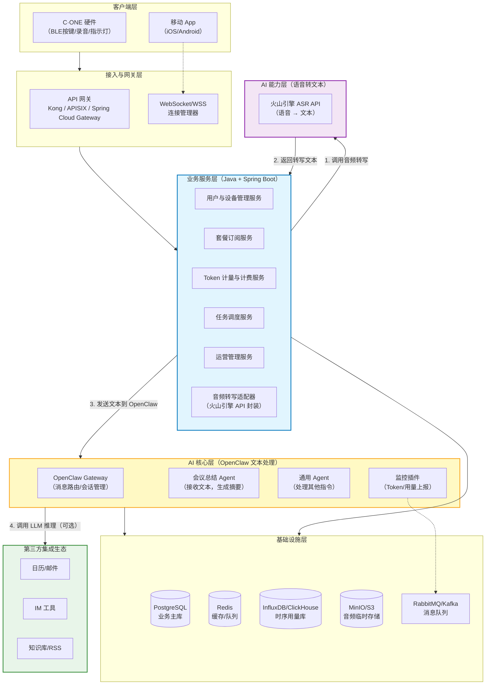
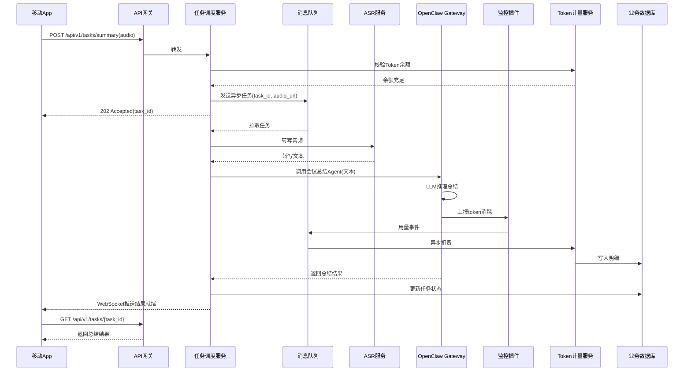
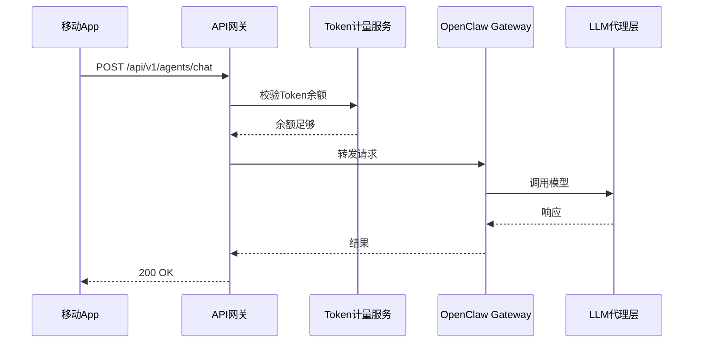

# YoooClaw C·ONE 仿制产品架构设计文档

## 文档信息

| 项目         | 内容                                    |
| ------------ | --------------------------------------- |
| **文档名称** | YoooClaw C·ONE 类产品软件架构设计说明书 |
| **版本**     | v1.0                                    |
| **最后更新** | 2026-06-11                              |
| **作者**     | 架构组                                  |
| **状态**     | 草案 / 评审中                           |

---

## 1. 引言

### 1.1 背景与目标

本项目旨在模仿 **YoooClaw C·ONE** 产品形态，打造一款以 **硬件伴侣 + 手机App + 云端AI** 为核心的智能语音助手系统。核心业务能力包括：

- **会议记录摘要**：用户通过硬件按键或App启动录音，音频上传云端后自动进行语音转文字、智能总结，生成会议纪要。
- **多Agent能力**：App端可调用通用Agent执行查询、设置提醒、文件处理等多种任务。
- **商业化能力**：支持用户订阅套餐、Token计量与扣费、用量监控、运营后台管理。

### 1.2 范围

本文档覆盖系统的**逻辑架构、物理部署、模块职责、数据流、技术选型、非功能需求及运维策略**。不包含硬件电路设计、具体UI/UX细节。

### 1.3 术语表

| 术语         | 解释                                            |
| ------------ | ----------------------------------------------- |
| C·ONE        | 磁吸式蓝牙硬件卡片，提供按键、录音、指示灯反馈  |
| OpenClaw     | 开源AI Agent框架，提供Gateway、Agent、Skill能力 |
| ASR          | 自动语音识别（Automatic Speech Recognition）    |
| Agent        | 智能体，可调用工具、执行任务、与LLM交互         |
| Token        | 大模型调用计费单位，1 token ≈ 0.75英文单词      |
| 任务调度服务 | 管理异步会议总结任务的生命周期                  |

---

## 2. 系统总体架构

### 2.1 架构分层图



### 2.2 架构说明

- **客户端层**：C·ONE硬件（低功耗蓝牙外设）与移动App（iOS/Android）。App负责蓝牙通信、音频采集、通知拦截、结果展示。
- **接入层**：统一API网关（处理认证、限流、路由）与WebSocket管理器（用于实时推送结果）。
- **业务服务层**（Java + Spring Boot）：核心业务中枢，包含用户管理、套餐订阅、Token计量、异步任务调度、运营后台。
- **AI核心层**（OpenClaw）：执行智能体任务。OpenClaw Gateway管理Agent生命周期，会议总结Agent和通用Agent分别处理不同场景。
- **AI能力层**：提供ASR语音转文字能力（Whisper）和LLM代理（多模型路由、降级、安全过滤）。
- **基础设施层**：关系数据库、缓存、时序数据库、对象存储、消息队列。

---

## 3. 核心模块职责

### 3.1 业务服务层

| 模块                    | 职责                                               | 关键接口                                         |
| ----------------------- | -------------------------------------------------- | ------------------------------------------------ |
| **用户与设备管理服务**  | 用户注册/登录、设备绑定/解绑、设备激活码校验       | `POST /api/users`, `POST /api/devices/bind`      |
| **套餐订阅服务**        | 套餐定义、用户订阅、订单管理、到期提醒             | `GET /api/plans`, `POST /api/subscriptions`      |
| **Token计量与计费服务** | 接收用量事件，扣减余额，生成明细和账单             | 消费Kafka topic `usage-events`，提供余额查询API  |
| **任务调度服务**        | 管理异步会议总结任务（创建、执行、状态跟踪、回调） | `POST /api/tasks/summary`, `GET /api/tasks/{id}` |
| **运营管理服务**        | 后台管理（用户、套餐、订单、用量报表），配置下发   | 内部接口，供管理员Web使用                        |

### 3.2 AI核心层（OpenClaw）

| 模块                 | 职责                                                |
| -------------------- | --------------------------------------------------- |
| **OpenClaw Gateway** | 中央调度器，管理WebSocket连接，路由消息到对应Agent  |
| **会议总结Agent**    | 专用Agent，接收ASR转写文本，调用LLM生成结构化摘要   |
| **通用Agent**        | 处理用户指令（查询、提醒、工具调用），可加载Skills  |
| **监控插件**         | 拦截每次LLM调用，将token消耗、延迟等指标推送到Kafka |

### 3.3 AI能力层

| 模块          | 职责                                                         |
| ------------- | ------------------------------------------------------------ |
| **ASR服务**   | 将音频流/文件转写成文本，支持多种语言，返回置信度            |
| **LLM代理层** | 统一接入多个大模型（Claude、GPT、DeepSeek等），实现路由、降级、负载均衡 |

---

## 4. 关键数据流设计

### 4.1 异步会议总结（核心场景）



### 4.2 通用Agent调用（同步）



---

## 5. 技术选型

| 层次           | 技术                                 | 版本/备注                 |
| -------------- | ------------------------------------ | ------------------------- |
| **业务后端**   | Java 21 + Spring Boot 3.x            | 核心业务服务              |
| **API网关**    | Spring Cloud Gateway 或 Kong         | 统一入口，支持限流、鉴权  |
| **OpenClaw**   | 官方最新稳定版                       | 基于Node.js 22+           |
| **ASR**        | Whisper（GPU集群） 或 阿里云智能语音 | 初期用云服务，后续自建    |
| **LLM代理层**  | Python + FastAPI                     | 多模型路由                |
| **关系数据库** | PostgreSQL 16                        | 用户、订单、任务状态      |
| **时序数据库** | ClickHouse 或 InfluxDB               | Token用量明细存储与聚合   |
| **缓存/队列**  | Redis 7.x + Kafka 3.x                | 会话缓存、异步任务队列    |
| **对象存储**   | MinIO / 阿里云OSS                    | 音频文件永久存储          |
| **监控**       | Prometheus + Grafana + Loki          | 指标、日志、追踪          |
| **移动端**     | Swift (iOS) + Kotlin (Android)       | 蓝牙、音频采集、WebSocket |
| **硬件**       | Nordic nRF52840（或其他BLE芯片）     | 低功耗蓝牙、按键、LED控制 |

---

## 6. 非功能性需求

### 6.1 性能指标

| 指标                 | 目标值                          |
| -------------------- | ------------------------------- |
| 会议总结任务平均耗时 | < 60秒（含ASR+LLM）             |
| 通用Agent调用P95延迟 | < 3秒                           |
| API网关吞吐量        | 5000 QPS（可水平扩展）          |
| 系统可用性           | 99.9%                           |
| 单用户Token计量延迟  | < 100ms（异步消费不影响主流程） |

### 6.2 安全策略

- **通信加密**：全链路TLS 1.3，WebSocket强制WSS。
- **认证授权**：JWT token，集成OAuth2（支持手机号/微信登录）。
- **数据隐私**：音频文件存储加密；ASR文本不落盘（仅内存处理）；通知拦截内容在端侧匿名化。
- **风控**：单用户每日/每月Token上限；API限流（基于用户+IP）。

### 6.3 可扩展性

- **业务服务**：无状态设计，支持K8s HPA。
- **OpenClaw**：支持多实例部署，通过Redis Pub/Sub实现会话共享。
- **AI能力层**：ASR和LLM代理均可横向扩展。
- **数据库**：读写分离，时序数据分片存储。

---

## 7. 部署与运维

### 7.1 部署拓扑（生产环境）

- **Kubernetes集群**（云平台或自建）：
  - 业务服务（Java Pods） × 3+
  - OpenClaw Gateway（Node.js Pods） × 2+
  - ASR服务（GPU节点，必要时使用Spot实例）
  - LLM代理层（Python Pods） × 2+
- **中间件**：使用云托管服务（RDS for PostgreSQL，Redis Cloud，Kafka托管，S3/OSS）
- **接入层**：负载均衡器（SLB） → API网关（Deployment）

### 7.2 监控告警

- **业务指标**：任务成功率、Token消耗速率、用户活跃数
- **AI指标**：LLM调用延迟、ASR错误率、OpenClaw Gateway连接数
- **基础设施**：CPU/内存使用率、队列堆积长度
- **告警规则**：
  - 任务失败率 > 5%（5分钟）
  - Token计量服务消费延迟 > 1分钟
  - OpenClaw Gateway Pod重启 > 3次/小时

### 7.3 灾备与恢复

- 数据库每日全量备份 + 实时WAL增量
- 对象存储跨区域复制
- 关键服务（任务调度、计量）部署多可用区
- 演练周期：每季度一次容灾切换

---

## 8. 演进路线

| 阶段     | 目标                                                | 预计时长 |
| -------- | --------------------------------------------------- | -------- |
| **MVP**  | 跑通会议总结核心链路，简单用户管理，预置Token不计费 | 1.5个月  |
| **V1.0** | 上线套餐订阅、Token计费、支付集成、运营后台         | 3个月    |
| **V1.5** | 接入多种LLM模型、用量报表、API限流、完善监控        | 2个月    |
| **V2.0** | 多Agent协作、长期记忆、C·ONE硬件量产发货            | 3个月+   |

---

## 9. 附录

### 9.1 参考文档

- OpenClaw 官方文档：[https://docs.openclaw.ai](https://docs.openclaw.ai)
- Whisper ASR模型：OpenAI Whisper GitHub
- Spring Boot 3 官方指南

### 9.2 关键配置示例

**任务调度服务 `application.yml` 核心片段**：

```yaml
spring:
  datasource:
    url: jdbc:postgresql://postgres:5432/yooo_claw
  redis:
    host: redis
  kafka:
    bootstrap-servers: kafka:9092
    consumer:
      group-id: task-service

openclaw:
  gateway-url: http://openclaw-gateway:18789
  summary-agent-id: meeting_summarizer
  default-model: gpt-4o-mini

billing:
  token-price-per-1k: 0.002  # 美元
  free-tier-limit: 10000
```

**OpenClaw 监控插件配置（`openclaw.json`）**：

```json
{
  "plugins": {
    "deep-observability": {
      "enabled": true,
      "kafkaBrokers": ["kafka:9092"],
      "topic": "usage-events",
      "reportMetrics": ["token_usage", "latency", "tool_calls"]
    }
  }
}
```

---

## 文档结束

> 本文档定稿后需经架构评审委员会审核，并根据实际开发迭代持续更新。